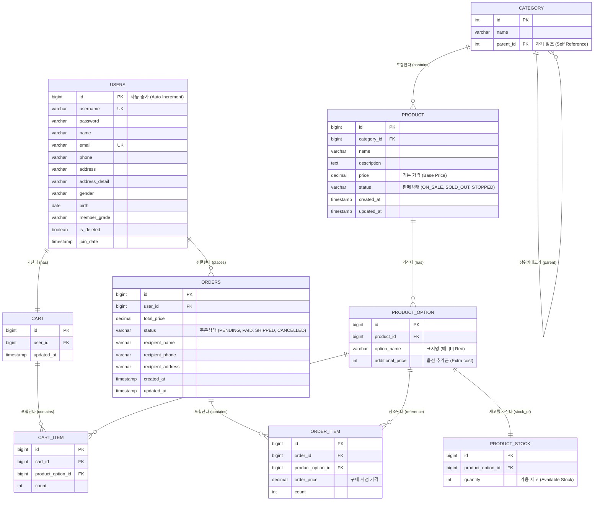

# 개체 관계 다이어그램 (ERD)

이 다이어그램은 **Open-Run** 커머스 플랫폼의 데이터 모델을 나타내며, 특히 "상품 - 옵션 - 재고" 구조와 핵심 커머스 흐름에 중점을 둡니다.

## 핵심 설계 원칙 (`Product` - `Option` - `Stock`)

1.  **상품 (Product)**: 상품의 공통 정보(이름, 기본 가격, 설명)를 관리합니다.
    - _예시_: "시원한 여름 티셔츠", 기본가: 10,000원
2.  **상품 옵션 (ProductOption)**: 실제 구매 가능한 단위(SKU)를 나타냅니다.
    - _예시_: 옵션 A (빨강, L, +0원), 옵션 B (파랑, XL, +2,000원)
    - _참고_: Phase 2에서는 색상/사이즈 등의 속성 그룹으로 더 정규화할 수 있지만, 대규모 트래픽이 몰리는 "오픈런" 시나리오에서는 단일 옵션 테이블이 가격 계산 및 유효성 검사에 효율적입니다.
3.  **상품 재고 (ProductStock)**: 동시성 이슈를 최소화하기 위해 `ProductOption`에서 분리했습니다. `quantity` 필드를 별도 테이블로 격리함으로써, 상품 상세 정보를 조회하는 트래픽 락(Lock) 경합 없이 재고 차감 로직(Optimistic Lock 또는 Redis 활용)에만 집중할 수 있습니다.
